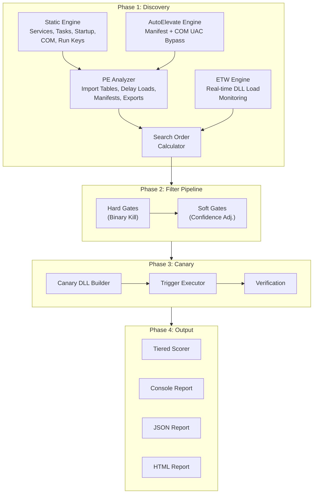
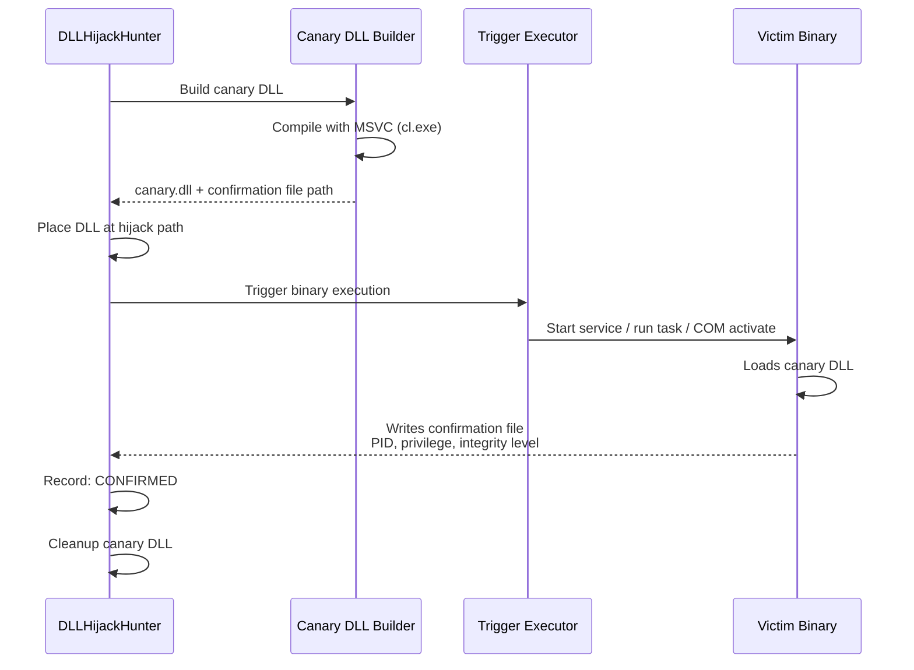

<p align="center">
  
  
  
  
</p>

<h1 align="center">DLLHijackHunter</h1>
<h4 align="center">By GhostVector Academy</h4>

<p align="center">
  <strong>Automated DLL Hijacking Discovery, Validation, and Confirmation</strong><br/>
  <em>Turning local misconfigurations into weaponized, confirmed attack paths.</em>
</p>

---

## Overview

**DLLHijackHunter** is an automated Windows DLL hijacking detection tool that goes beyond static analysis. It discovers, validates, and confirms DLL hijacking opportunities using a multi-phase pipeline:

1. **Discovery** — Enumerates binaries across services, scheduled tasks, startup items, COM objects, and AutoElevate UAC bypass vectors
2. **Filtration** — Eliminates false positives through intelligent hard and soft gates
3. **Canary Confirmation** — Deploys a harmless canary DLL and triggers the binary to prove the hijack works
4. **Scoring & Reporting** — Ranks findings by exploitability with a tiered confidence system

> Most DLL hijacking tools stop at “this DLL might be hijackable.” DLLHijackHunter attempts to validate it, cross-reference it against known exploit intelligence, and confirm real execution paths where possible.

---

## Architecture



---

## Key Features

### Hijack Type Coverage

| Type | Description | Stealth |
|---|---|---|
| **Phantom** | DLL doesn't exist anywhere on disk | High |
| **Search Order** | Place DLL earlier in the Windows search order | High |
| **Side-Loading** | Abuse legitimate app loading DLLs from its directory | High |
| **.local Redirect** | Hijack via `.local` directory redirection | High |
| **KnownDLL Bypass** | Attempt bypass via `.local` or WoW64 edge cases | Medium |
| **ENV PATH** | Weaponization of writable directories in system `PATH` | High |
| **CWD** | Current Working Directory hijack | Low |
| **AppInit DLLs** | `AppInit_DLLs` registry abuse | Low |
| **IFEO** | Image File Execution Options debugger abuse | Medium |
| **AppCert DLLs** | `AppCertDLLs` registry hijack | Low |

### UAC Bypass Discovery

DLLHijackHunter includes dedicated UAC bypass discovery:

- **Manifest AutoElevate** — Scans `System32` and `SysWOW64` for EXEs with `<autoElevate>true</autoElevate>` in embedded manifests
- **COM AutoElevation** — Scans `HKLM\SOFTWARE\Classes\CLSID` for COM objects with `Elevation\Enabled=1`
- **Side-Load Simulation** — For AutoElevate binaries that do not call `SetDllDirectory` or `SetDefaultDllDirectories`, simulates the “copy EXE to writable folder + drop DLL” attack path

### Targeted Vulnerability Knowledge Base

- **Targeted vulnerability mapping** — Cross-references discovered imports against an offline dictionary of known vulnerable software patterns (for example, HijackLibs-style matches)
- **Automated PATH exploitation** — Evaluates writable `PATH` folders and generates hijack candidates for native Windows services that search `PATH` for missing DLLs
- **Expanded phantom DLL hunting** — Searches for a broad library of high-value phantom DLL opportunities across multiple categories

### Filter Pipeline

The pipeline reduces false positives through two stages:

**Hard Gates**
- API set schema filtering (`api-ms-*`, `ext-ms-*`)
- KnownDLL filtering
- ACL-based writability validation

**Soft Gates**
- WinSxS manifest penalty
- Privilege delta analysis
- `LoadLibraryEx` mitigation checks
- Signature validation checks
- Graceful error-handling penalties

---

## Canary Confirmation

Instead of guessing, DLLHijackHunter attempts to prove hijacks work:



The canary DLL:
- Is built with **MSVC (`cl.exe`)**
- Uses a **file-based confirmation mechanism**
- Captures execution metadata such as user, integrity level, and privilege indicators
- Contains no malicious payload; it is strictly a detection and validation mechanism

### Important note on proxy/export-forwarding mode

Proxy/export-forwarding canaries are **experimental** and **best-effort**. Some targets may fail to load correctly or may behave unexpectedly depending on:

- ordinal-only exports
- decorated export names
- calling convention mismatches
- loader/runtime assumptions in the target process

That means a failed proxy canary does **not always** mean the underlying hijack path is impossible.

---

## Comparison

| Feature | **DLLHijackHunter** | Robber | DLLSpy | WinPEAS | Procmon |
|---|:---:|:---:|:---:|:---:|:---:|
| Automated discovery | ✅ | ✅ | ✅ | ✅ | ❌ |
| Phantom DLL detection | ✅ | ❌ | ✅ | ❌ | ✅ |
| Search order analysis | ✅ | ❌ | ❌ | ❌ | ❌ |
| ACL-based writability check | ✅ | Partial | ❌ | Basic | ❌ |
| ETW real-time monitoring | ✅ | ❌ | ❌ | ❌ | ✅ |
| Canary confirmation | ✅ | ❌ | ❌ | ❌ | ❌ |
| Privilege escalation check | ✅ | ❌ | ❌ | ❌ | ❌ |
| UAC bypass discovery | ✅ | ❌ | ❌ | ❌ | ❌ |
| False positive reduction | ✅ | None | Basic | None | None |
| Reboot persistence check | ✅ | ❌ | ❌ | ❌ | ❌ |
| Proxy DLL generation | ✅ | ❌ | ❌ | ❌ | ❌ |
| Confidence scoring | ✅ | ❌ | ❌ | ❌ | ❌ |
| Auto trigger (svc/task/COM) | ✅ | ❌ | ❌ | ❌ | ❌ |
| HTML/JSON reporting | ✅ | ❌ | ❌ | TXT | ❌ |
| Threat intel correlation | ✅ | ❌ | ❌ | ❌ | ❌ |
| Automated PATH exploits | ✅ | ❌ | ❌ | ❌ | ❌ |
| Target-specific scanning | ✅ | ❌ | ❌ | ❌ | ✅ |
| Self-contained binary | ✅ | ❌ | ❌ | ✅ | ❌ |

---

## Usage

### Prerequisites

- **Windows 10/11** or **Windows Server 2016+**
- **.NET 8.0 Runtime** (or use a self-contained build)
- **Administrator privileges** recommended (required for ETW, canary deployment, and some service triggers)

### Build

```powershell
git clone https://github.com/ghostvectoracademy/DLLHijackHunter.git
cd DLLHijackHunter

# Build (self-contained single file)
dotnet publish src/DLLHijackHunter/DLLHijackHunter.csproj `
    -c Release -r win-x64 --self-contained `
    -p:PublishSingleFile=true -o ./publish

# Or use the build script
.\build.ps1
```

### Quick Start

```powershell
# Full aggressive scan (recommended, requires admin)
.\DLLHijackHunter.exe --profile aggressive

# Safe scan (no file drops, no triggers)
.\DLLHijackHunter.exe --profile safe

# UAC bypass focused scan
.\DLLHijackHunter.exe --profile uac-bypass

# Target a specific binary
.\DLLHijackHunter.exe --target "C:\Program Files\MyApp\app.exe"

# Target by filename (partial match)
.\DLLHijackHunter.exe --target notepad.exe

# Confirmed findings only
.\DLLHijackHunter.exe --profile redteam --format json -o report.json
```

### CLI Options

```text
DLLHijackHunter — Automated DLL Hijacking Detection

Options:
  -p, --profile <profile>        Scan profile [default: aggressive]
                                   aggressive | strict | safe | redteam | uac-bypass
  -o, --output <path>            Output file path (auto-detects format)
  -f, --format <format>          Output format [default: console]
                                   console | json | html
  -t, --target <target>          Target specific binary, directory, or filename
      --min-confidence <value>   Minimum confidence threshold 0-100 [default: 20]
      --no-canary                Disable canary confirmation
      --no-etw                   Disable ETW runtime discovery
      --confirmed-only           Only show canary-confirmed findings
  -v, --verbose                  Verbose output
```

### Scan Profiles

| Profile | Use Case | Canary | ETW | UAC Bypass | Min Confidence | Triggers |
|---|---|:---:|:---:|:---:|:---:|---|
| **aggressive** | Full audit, lab environments | ✅ | ✅ | ✅ | 15% | Services, Tasks, COM |
| **strict** | High-confidence findings only | ✅ | ✅ | ❌ | 80% | Services, Tasks |
| **safe** | Production systems, read-only | ❌ | ❌ | ❌ | 50% | None |
| **redteam** | Confirmed exploitable only | ✅ | ✅ | ❌ | 50% | Services, Tasks, COM |
| **uac-bypass** | UAC bypass vectors only | ❌ | ❌ | ✅ | 20% | AutoElevate only |

---

## Scoring

Each finding receives confidence and impact signals that are combined into a final prioritization tier.

Typical impact considerations include:
- privilege gained
- trigger reliability
- stealth
- reboot persistence

Confirmed canary execution should be treated as the strongest validation signal.

---

## Safety

DLLHijackHunter is designed for defensive security research, lab validation, auditing, and red-team simulation in authorized environments.

Use it only on systems and networks you own or are explicitly authorized to assess.

### Operational notes

- Canary mode writes test DLLs to candidate locations
- Some triggers may briefly start or stop services/tasks during validation
- Proxy/export-forwarding canaries may destabilize fragile targets
- Safe profile is the preferred mode for production triage when file drops and triggers are not acceptable

---

## Output

DLLHijackHunter supports:
- console reporting
- JSON export
- HTML export

Recommended workflow:
1. run a broad scan
2. review high-confidence findings
3. use canary confirmation selectively on high-value paths
4. preserve JSON/HTML output for reporting and triage

---

## License

MIT

---

## Credits

Built by **GhostVector Academy**.
